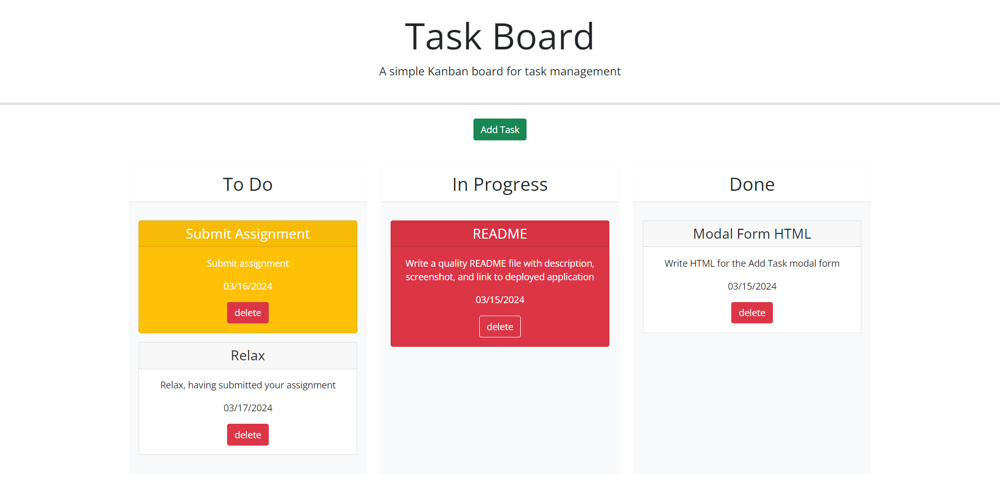

# task-board

## Description

The Task Board will enable a user to keep track of and update the status and progress of existing tasks, add new tasks and remove completed tasks. 

## Usage

To begin adding new tasks to the board you can press the `Add Task` button. This will bring up the task form, where the user must enter the `Title`, `Due Date` and `Description` of the task (note: the `Due Date` can be input via a datepicker).

Once the form is filled out, clicking `Submit` will post the new task to the `To Do` section of the board. The colour of the card will automatically be adjusted based on whether the task is overdue (red), due today (yellow), or due further in to the future.

With the board now populated with tasks the user can update their status by dragging and dropping them to the relevant section of the board. If work has begun on them they should be placed in the `In Progress` section, and if the task is complete they should be placed in the `Done` section.

Finally, if the user is wishes to remove a task from the board, they can click the task card's `Delete` button.

>Deployment can be found here:
[https://simonjbr.github.io/task-board/](https://simonjbr.github.io/task-board/)

>Screenshot of deployed webpage:

## Credits

Starter code provided by edX.

simonjbr

Libraries used:
- Bootstrap
- jQuery
- jQuery UI
- Day.js

## License

Please refer to license information in the repository